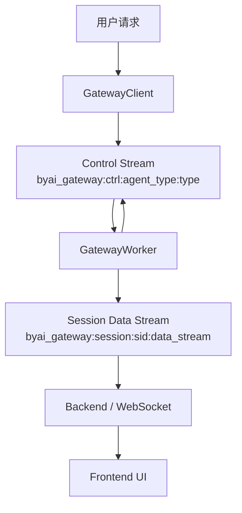
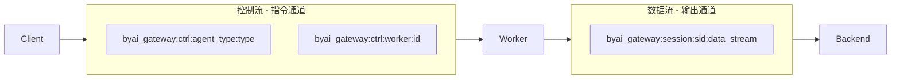
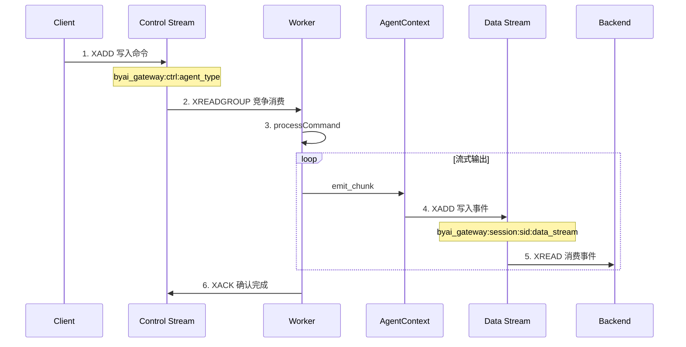
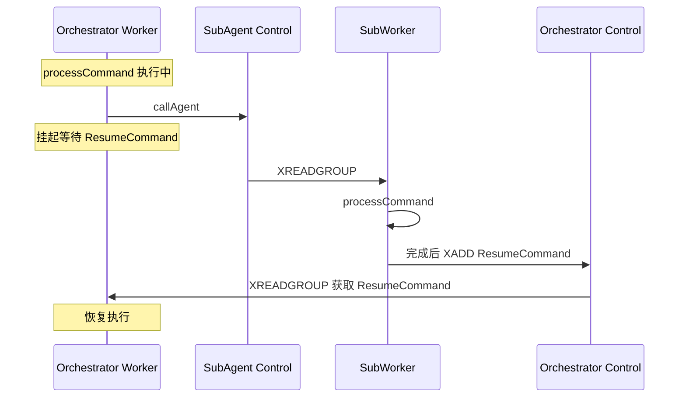
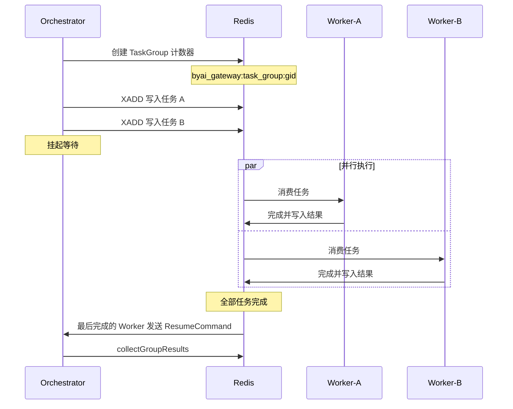

# 数据流设计

## 数据流概览

## 控制流 vs 数据流

by-framework 采用**控制流与数据流分离**的设计，这是整个架构的核心特征：

### 控制流 (Control Stream)

| 属性 | 说明 |
|------|------|
| **Key** | `byai_gateway:ctrl:agent_type:{agent_type}` |
| **用途** | 任务分发、调度指令 |
| **消费模式** | 竞争消费 — 多 Worker 通过 Consumer Group 抢单 |
| **Consumer Group** | `byai_gateway:consumer_group:agent_engines` |

### Worker 定向控制流

| 属性 | 说明 |
|------|------|
| **Key** | `byai_gateway:ctrl:worker:{worker_id}` |
| **用途** | 定向下发给指定 Worker（debug / 取消任务） |
| **消费模式** | 单 Worker 独占消费 |

### 数据流 (Data Stream)

| 属性 | 说明 |
|------|------|
| **Key** | `byai_gateway:session:{session_id}:data_stream` |
| **用途** | 流式输出、状态变更、产物数据 |
| **消费模式** | 共享订阅 — 所有消费者都能读到全部消息 |

## 消息生命周期

1. **① 发送**: Client 调用 `sendMessage()` 向 Control Stream 写入命令
2. **② 路由**: Redis Consumer Group 将消息分发到某个 Worker
3. **③ 处理**: Worker 的 `processCommand()` 执行业务逻辑
4. **④ 输出**: Worker 通过 `context.emit_*()` 向 Session Data Stream 写入事件
5. **⑤ 消费**: Backend 持续读取 Data Stream 并通过 WebSocket 推送给前端
6. **⑥ 确认**: Worker 处理完成后发送 XACK 确认消息

## Agent 间调用数据流

当一个 Agent 需要调用另一个 Agent 时，控制流会产生级联：

## Scatter-Gather 数据流

`dispatchGroup()` 实现一对多分发与结果收集：

