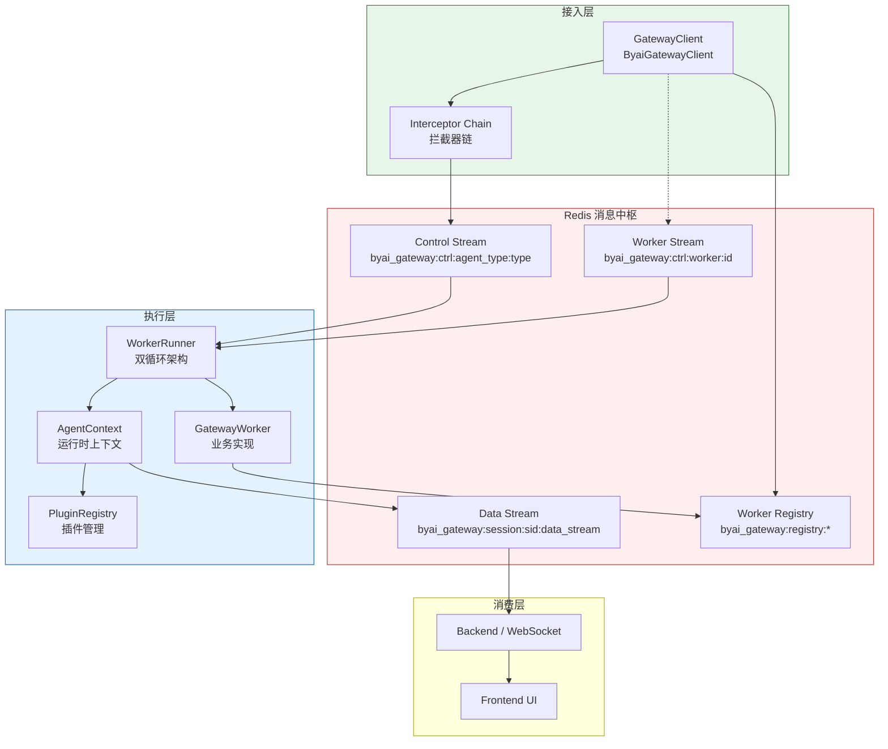
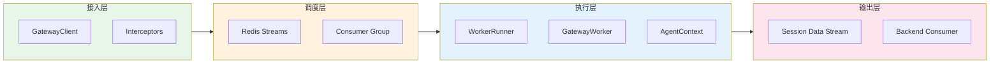
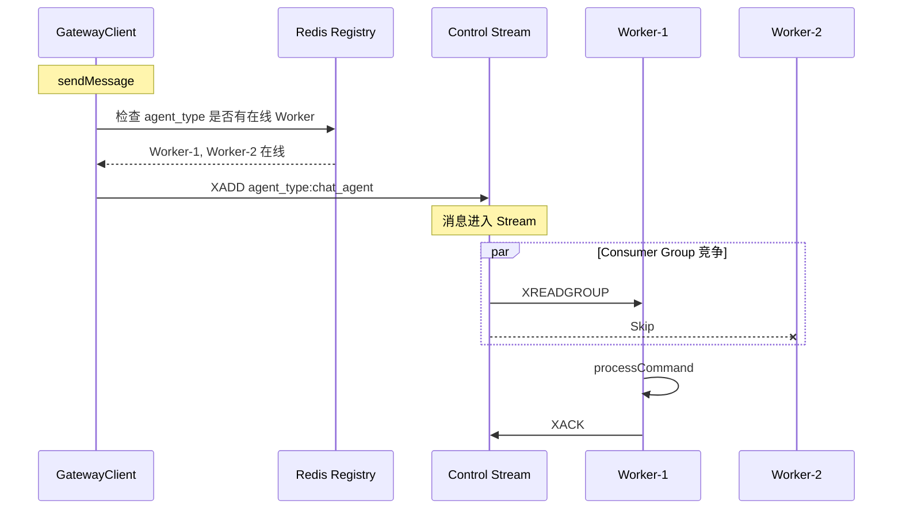
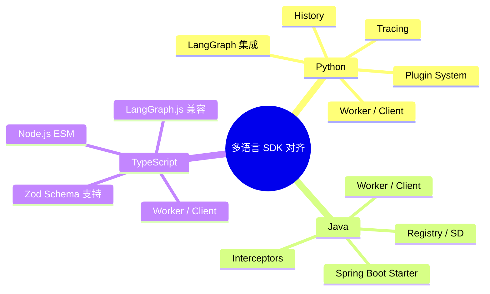

# 系统架构概述

## 核心设计理念

by-framework 是一个分布式、高性能 Agent 调度引擎，构建于 Redis Streams 之上，采用事件驱动架构实现高度解耦。支持 Python、Java、TypeScript 三种语言 SDK。

## 系统架构图

## 核心组件

各语言 SDK 实现了相同的核心组件，API 风格根据语言惯例做了适配：

| 组件 | 职责 |
|------|------|
| `GatewayWorker` | 抽象基类，实现 `getAgentTypes()` 和 `processCommand()` |
| `AgentContext` | 运行时上下文，发射 chunks、states、artifacts，调用其他 Agent |
| `runWorker()` | Worker 启动入口 |
| `GatewayClient` | 向 Redis Streams 发送命令 |
| `ByaiGatewayClient` | GatewayClient + ByaiMessageInterceptor |
| `Plugin` | 插件基类，提供生命周期钩子 |
| `PluginRegistry` | 插件注册与发现 |
| `WorkerRegistry` | Worker 在线状态与心跳管理 |
| `ServiceRegistry` | 服务注册与心跳（服务发现） |
| `DiscoveryClient` | 带缓存的服务发现 |

## Gateway 核心概念解析

在 **by-framework** 的系统架构中，核心通信与调度组件以 **Gateway（网关）** 命名（如 `GatewayClient`、`GatewayWorker` 以及底层 `byai_gateway` 消息队列）。这一架构设计旨在解决分布式智能体系统中的三个核心工程需求：

### 1. 边界解耦：同步与异步的协议网关
前端业务系统（如 HTTP/WebSocket 等同步请求）与 Agent 的长耗时推理（异步执行）之间存在并发阻抗。**Gateway 在此充当隔离带和协议转换器**：
`GatewayClient` 嵌入在业务后端中拦截同步请求，并将其转化为异步的 `AskAgentCommand` 任务压入消息队列。这保障了在高并发场景下，业务服务不会因大模型推理耗时而发生线程阻塞。

### 2. 调度与路由：任务分发的流量集线器
Gateway 层承担了底层任务的智能路由（Routing）职责。
开发者无需硬编码远程函数调用或维护 Worker 节点的网络地址，仅需在指令中声明 `target_agent_type`。Gateway 机制利用 Redis Consumer Group，自动将任务路由给当前在线、空闲且匹配该类型的 `GatewayWorker`，实现透明的服务发现与负载均衡。

### 3. 数据流与控制流的全景管控
Gateway 负责接管 Agent 在分布式环境下的整个生命周期状态流转：
- **控制流 (Control Plane)**：负责任务下发、监听 Worker 心跳状态，并在异常或超时时发送 `CancelTaskCommand` 紧急中断协程执行。
- **数据流 (Data Plane)**：接管 Worker 运行中产生的流式字符（`emit_chunk`）和状态转移，统一封装为标准流式报文，跨节点推回给消费端。

综上所述，**Gateway 是 by-framework 底层的高性能分布式通信与调度基座**，它为上层的智能体业务逻辑提供了透明的并发管理与状态同步能力。

## 分层架构

### ① 接入层
`GatewayClient` 通过拦截器链处理消息后，向 Redis Control Stream 投递控制指令。

### ② 调度层
利用 Redis Stream + Consumer Group 实现 Worker 集群的竞争消费与路由。

### ③ 执行层
`WorkerRunner` 主动拉取任务，在独立的 `AgentContext` 中执行业务逻辑。插件在关键生命周期点介入。

### ④ 输出层
数据异步写入会话级 data stream（`byai_gateway:session:{sid}:data_stream`），供下游消费者读取。

## Worker 路由机制

### Membership

Worker 启动时通过 `getAgentTypes()` 声明自己支持的 Agent 类型。框架将此信息写入 Redis：

- `byai_gateway:registry:agent_type:workers:{agentType}` — Agent type → Worker 集合
- `byai_gateway:registry:worker:agent_types:{workerId}` — Worker → Agent types 集合

### Online / Heartbeat

Worker 使用租约模式维护在线状态：

- `byai_gateway:registry:worker:online:{workerId}` — 在线租约，TTL 15s
- 每 5s 续约一次，过期即视为离线

### Worker ID Lock

- `byai_gateway:registry:worker:lock:{workerId}` — 互斥锁，TTL 60s
- 防止同一个 `worker_id` 被重复启动

## SDK 功能对齐

