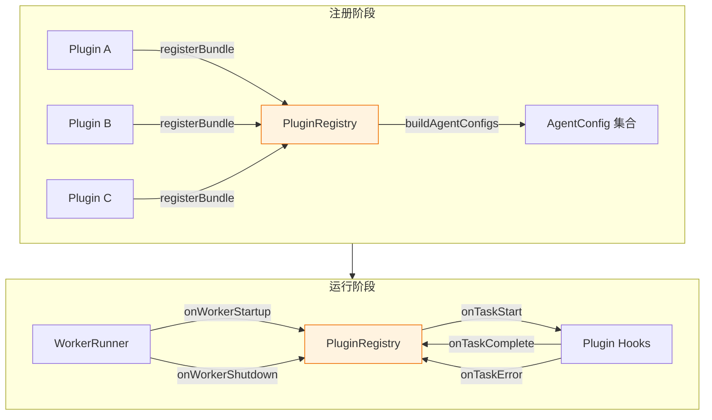
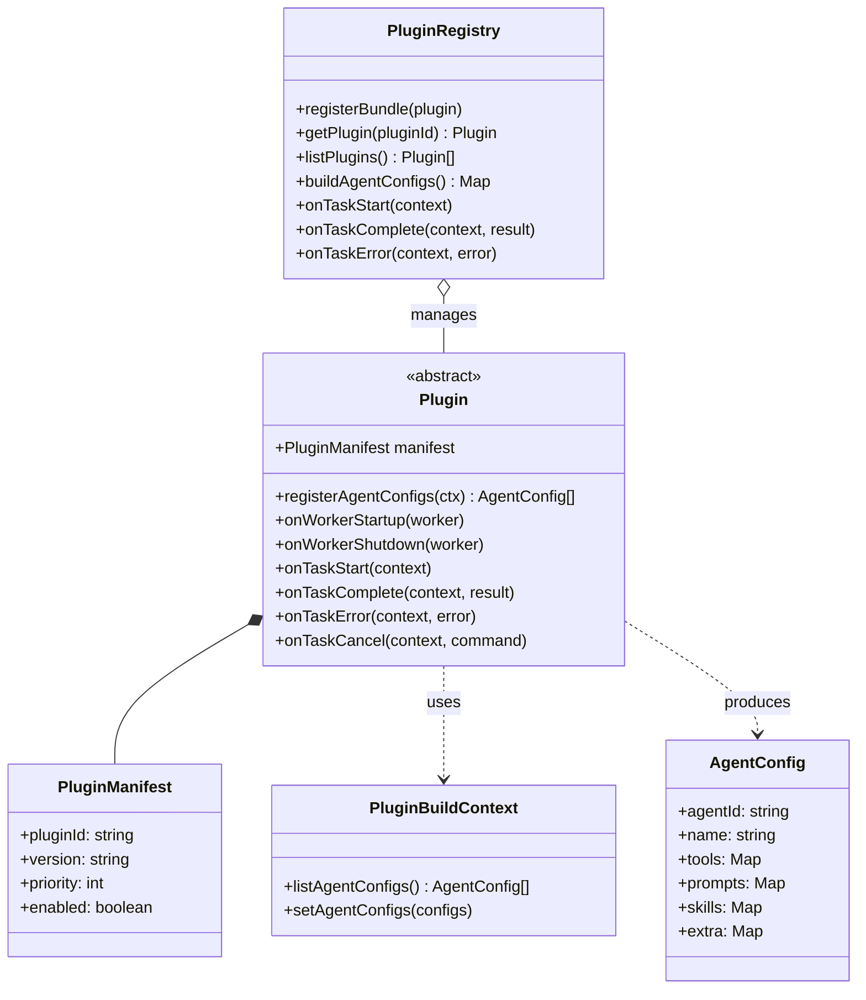
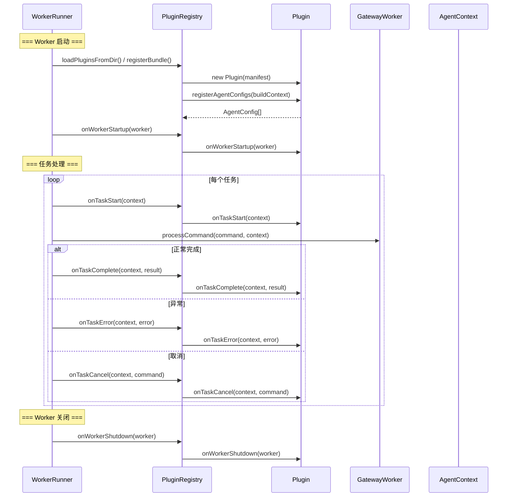
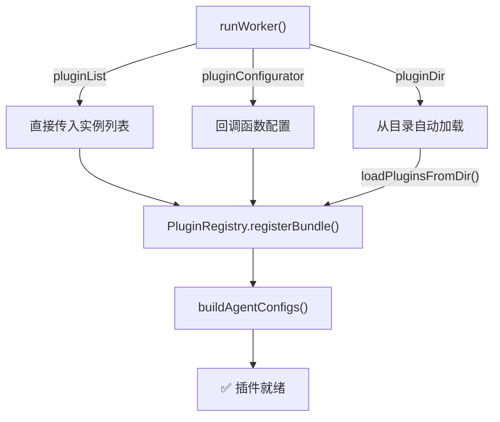

# 插件系统架构

## 插件架构总览



## 核心组件关系



## 插件生命周期



## PluginRegistry API

=== "Python"

    ```python
    class PluginRegistry:
        def register_bundle(self, plugin: Plugin) -> None:
            """注册插件"""

        def get_plugin(self, plugin_id: str) -> Optional[Plugin]:
            """获取插件"""

        def list_plugins(self) -> List[Plugin]:
            """列出所有插件"""

        def build_agent_configs(self) -> Dict[str, AgentConfig]:
            """构建所有 Agent 配置"""
    ```

=== "Java"

    ```java
    public class PluginRegistry {
        public void registerBundle(Plugin plugin)
        public Plugin getPlugin(String pluginId)
        public List<Plugin> listPlugins()
    }
    ```

=== "TypeScript"

    ```typescript
    export class PluginRegistry {
        registerBundle(plugin: Plugin): void
        getPlugin(pluginId: string): Plugin | undefined
        listPlugins(): Plugin[]
        async loadPluginsFromDir(dir: string): Promise<void>
    }
    ```

## 插件加载方式



=== "Python"

    ```python
    # 方式一：直接传入
    run_worker(MyWorker, plugin_list=[MyPlugin()])

    # 方式二：回调配置
    run_worker(MyWorker, plugin_configurator=lambda reg: reg.register_bundle(MyPlugin()))

    # 方式三：目录加载
    run_worker(MyWorker, plugin_dir="./my_plugins")
    ```

=== "TypeScript"

    ```typescript
    // 方式一：直接传入
    runWorker(MyWorker, { pluginList: [new MyPlugin()] });

    // 方式二：回调配置
    runWorker(MyWorker, {
        pluginConfigurator: (reg) => reg.registerBundle(new MyPlugin()),
    });

    // 方式三：目录加载
    runWorker(MyWorker, { pluginDir: "./my_plugins" });
    ```

## 工具注册

=== "Python"

    ```python
    class MyPlugin(Plugin):
        async def register_agent_configs(
            self, build_context: PluginBuildContext
        ) -> list[AgentConfig]:
            return [
                AgentConfig(
                    agent_id="my_agent",
                    tools={"my_tool": self.my_tool},
                )
            ]

        async def my_tool(self, arg1: str, arg2: int) -> dict:
            return {"result": f"{arg1} - {arg2}"}
    ```

=== "Java"

    ```java
    // Java 通过 PluginRegistry 的回调机制实现工具注册
    // 具体工具通过 Worker processCommand 中实现
    ```

=== "TypeScript"

    ```typescript
    class MyPlugin extends Plugin {
        async registerAgentConfigs(
            buildContext: PluginBuildContext
        ): Promise<AgentConfig[]> {
            return [
                new AgentConfig({
                    agentId: "my_agent",
                    tools: { my_tool: this.myTool.bind(this) },
                }),
            ];
        }

        async myTool(arg1: string, arg2: number) {
            return { result: `${arg1} - ${arg2}` };
        }
    }
    ```
