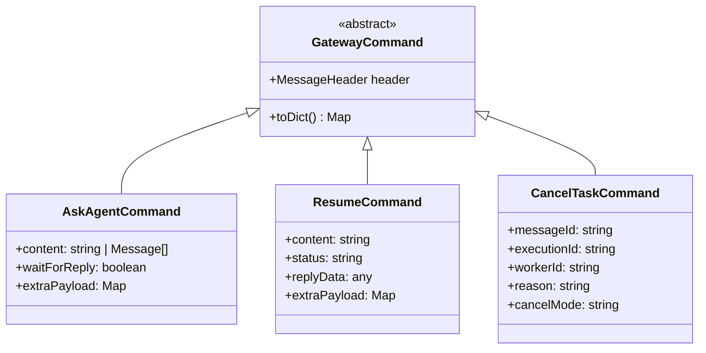
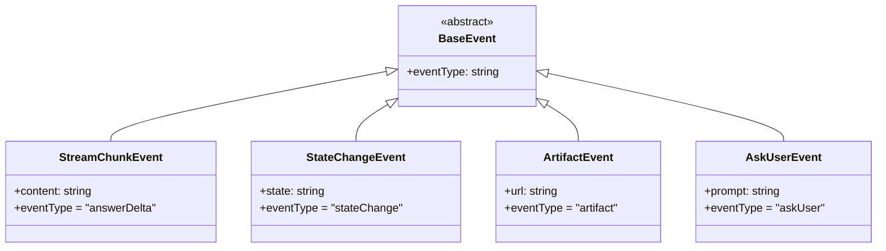
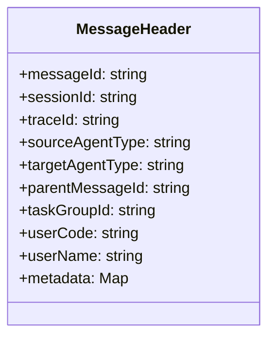
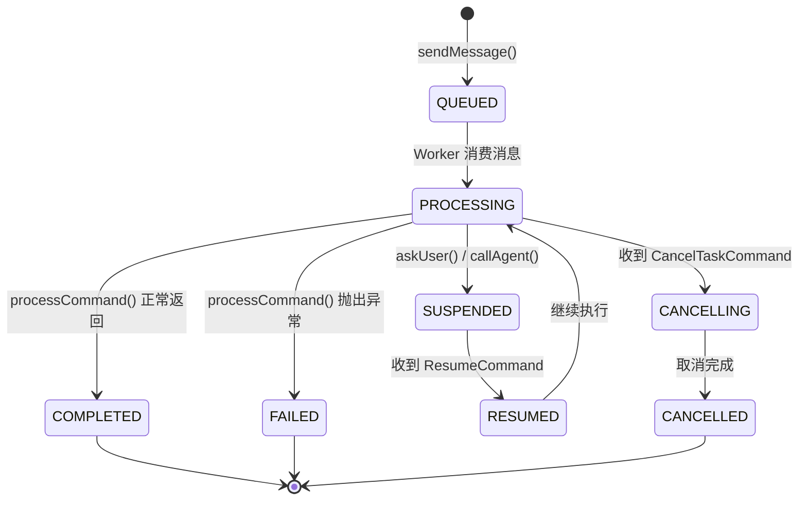

# 协议设计

## 协议总览

by-framework 的消息协议基于 Redis Streams，分为**命令**（Client → Worker）和**事件**（Worker → Consumer）两个方向。

```mermaid
graph LR
    subgraph 命令 ["命令 (Client → Worker)"]
        direction TB
        A1["AskAgentCommand<br/>发起任务"]
        A2["ResumeCommand<br/>恢复挂起任务"]
        A3["CancelTaskCommand<br/>取消任务"]
    end

    subgraph 事件 ["事件 (Worker → Consumer)"]
        direction TB
        E1["StreamChunkEvent<br/>流式文本片段"]
        E2["StateChangeEvent<br/>状态变更"]
        E3["ArtifactEvent<br/>产物/附件"]
        E4["AskUserEvent<br/>请求用户输入"]
    end

    Client["GatewayClient"] --> 命令
    命令 -->|"Control Stream<br/>byai_gateway:ctrl:*"| Worker["GatewayWorker"]
    Worker --> 事件
    事件 -->|"Data Stream<br/>byai_gateway:session:{sid}:data_stream"| Consumer["Backend"]

    style 命令 fill:#e8f5e9,stroke:#2e7d32
    style 事件 fill:#e3f2fd,stroke:#1565c0
```



## 命令 (Commands)

命令是客户端发给 Worker 的指令消息，所有语言 SDK 共享相同的协议结构。

### 命令类型关系



### AskAgentCommand

任务指令，用于向 Agent 发送请求：

=== "Python"

    ```python
    from by_framework.core.protocol.commands import AskAgentCommand
    from by_framework.core.protocol.message_header import MessageHeader

    command = AskAgentCommand(
        header=MessageHeader(
            message_id="msg_123",
            session_id="sess_456",
            target_agent_type="weather_agent"
        ),
        content="查询北京天气",
        extra_payload={
            "location": "北京"
        }
    )
    ```

=== "Java"

    ```java
    import com.iwhaleai.byai.framework.core.protocol.AskAgentCommand;
    import com.iwhaleai.byai.framework.core.protocol.MessageHeader;

    AskAgentCommand command = AskAgentCommand.of(
        MessageHeader.builder()
            .messageId("msg_123")
            .sessionId("sess_456")
            .targetAgentType("weather_agent")
            .build(),
        "查询北京天气",
        false,
        Map.of("location", "北京")
    );
    ```

=== "TypeScript"

    ```typescript
    import { AskAgentCommand, MessageHeader } from 'byclaw-gateway-sdk';

    const command = new AskAgentCommand(
        new MessageHeader("msg_123", "sess_456", "trace_789", {
            targetAgentType: "weather_agent",
        }),
        "查询北京天气",
        false,
        { location: "北京" }
    );
    ```

### CancelTaskCommand

取消任务指令，支持级联取消（自动取消子 Agent 任务）：

=== "Python"

    ```python
    CancelTaskCommand(
        header=header,
        reason="用户主动取消"
    )
    ```

=== "Java"

    ```java
    CancelTaskCommand.of(header, messageId, executionId, workerId, "用户主动取消");
    ```

=== "TypeScript"

    ```typescript
    new CancelTaskCommand(header, messageId, executionId, workerId, "用户主动取消");
    ```

### ResumeCommand

恢复被挂起的任务（人机交互、Agent 间调用场景）：

=== "Python"

    ```python
    ResumeCommand(
        header=header,
        content="用户输入的内容"
    )
    ```

=== "Java"

    ```java
    ResumeCommand.of(header, "用户输入的内容", "COMPLETED", replyData, extraPayload);
    ```

=== "TypeScript"

    ```typescript
    new ResumeCommand(header, "用户输入的内容", "COMPLETED", replyData, extraPayload);
    ```

## 事件 (Events)

事件是 Worker 产出的数据消息，写入会话级 data stream（`byai_gateway:session:{session_id}:data_stream`）。

### 事件类型关系



### StreamChunkEvent

流式文本片段：

```json
{
    "content": "正在处理...",
    "event_type": "answerDelta"
}
```

### StateChangeEvent

状态变更：

```json
{
    "state": "thinking",
    "event_type": "stateChange"
}
```

### ArtifactEvent

产物/附件：

```json
{
    "url": "https://example.com/result.json",
    "event_type": "artifact"
}
```

### AskUserEvent

向用户请求输入（挂起当前任务）：

```json
{
    "prompt": "请确认是否继续？",
    "event_type": "askUser"
}
```

## 消息头 (MessageHeader)

所有命令和事件都携带统一的消息头：



=== "Python"

    ```python
    from by_framework.core.protocol.message_header import MessageHeader

    header = MessageHeader(
        message_id="msg_123",        # 消息唯一ID
        session_id="sess_456",       # 会话ID
        trace_id="trace_789",       # 追踪ID
        target_agent_type="weather_agent"  # 目标Agent类型
    )
    ```

=== "Java"

    ```java
    MessageHeader header = MessageHeader.builder()
        .messageId("msg_123")
        .sessionId("sess_456")
        .traceId("trace_789")
        .targetAgentType("weather_agent")
        .build();
    ```

=== "TypeScript"

    ```typescript
    const header = new MessageHeader("msg_123", "sess_456", "trace_789", {
        targetAgentType: "weather_agent",
    });
    ```

## Agent 状态机



## 常用 EventType 值

| 事件类型 | 描述 |
|---------|------|
| `answerDelta` | 回答内容增量 |
| `reasoningLogDelta` | 推理或中间日志输出 |
| `appStreamResponse` | 标记流结束 |
| `stateChange` | 状态变更 |
| `artifact` | 产物/附件 |
| `askUser` | 请求用户输入 |
| `taskCreate` | 任务创建相关事件 |
| `taskStop` | 任务终止相关事件 |
