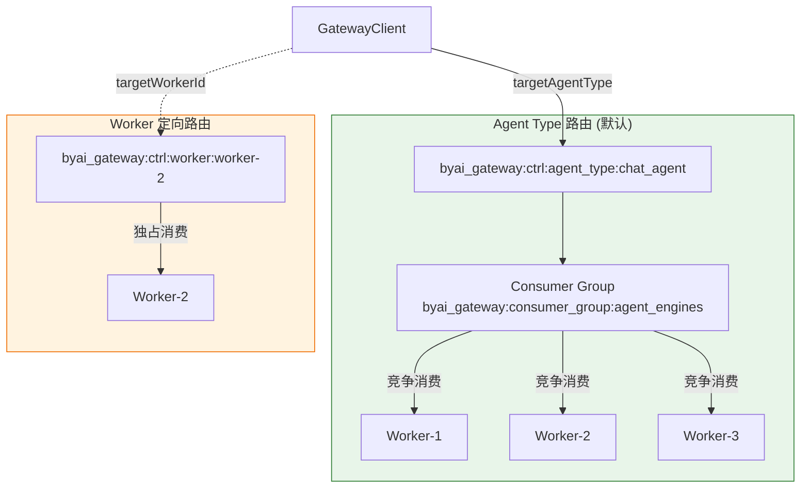
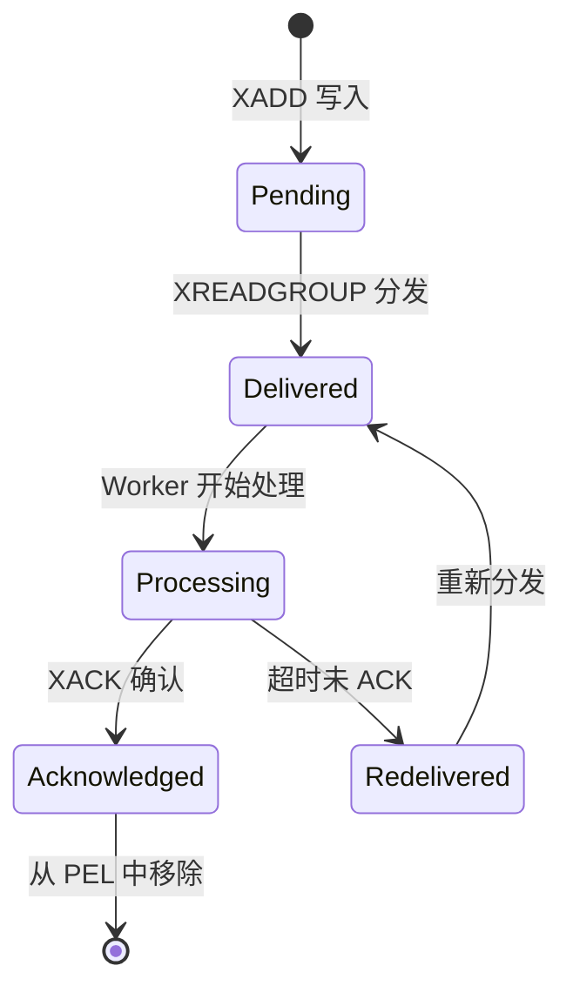
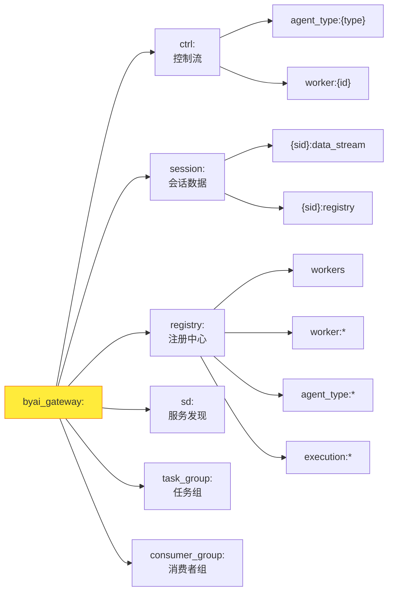

# Redis Streams 深度剖析

## 为什么选择 Redis Streams

```mermaid
mindmap
  root((Redis Streams))
    持久化
      消息落盘不丢失
      AOF / RDB 持久化
    消费组
      Consumer Group 竞争消费
      自动负载均衡
    范围查询
      按 ID 范围读取历史
      支持 XRANGE / XREVRANGE
    ACK 机制
      PEL 待确认列表
      未 ACK 自动重投
    高性能
      单分区 O(1) 写入
      支持批量读取
```

## 完整 Redis Key 参考

### Stream Keys（消息队列）

| Key 模式 | 类型 | 用途 |
|----------|------|------|
| `byai_gateway:ctrl:agent_type:{agent_type}` | Stream | Agent type 控制流，Worker 竞争消费 |
| `byai_gateway:ctrl:worker:{worker_id}` | Stream | Worker 定向控制流，单 Worker 消费 |
| `byai_gateway:session:{session_id}:data_stream` | Stream | 会话级数据流，Worker 输出通道 |

### Registry Keys（注册中心）

| Key 模式 | 类型 | 用途 |
|----------|------|------|
| `byai_gateway:registry:workers` | Set | 所有已知 Worker ID 集合 |
| `byai_gateway:registry:worker:online:{worker_id}` | String | Worker 在线租约（TTL 15s） |
| `byai_gateway:registry:worker:lock:{worker_id}` | String | Worker 启动互斥锁（TTL 60s） |
| `byai_gateway:registry:worker:agent_types:{worker_id}` | Set | Worker 声明的 Agent type 集合 |
| `byai_gateway:registry:agent_type:workers:{agent_type}` | Set | Agent type 的成员 Worker 集合 |

### Execution Keys（执行追踪）

| Key 模式 | 类型 | 用途 |
|----------|------|------|
| `byai_gateway:session:{session_id}:registry` | Hash | 会话级聚合注册表 |
| `byai_gateway:registry:execution:detail:{execution_id}` | Hash | 单次执行详情 |
| `byai_gateway:registry:execution:by_message:{message_id}` | String | 消息 ID → 执行 ID 映射 |
| `byai_gateway:registry:session:executions:{session_id}` | Set | 会话下所有执行 ID |

### Task Group Keys（任务组）

| Key 模式 | 类型 | 用途 |
|----------|------|------|
| `byai_gateway:task_group:{group_id}` | Hash | 任务组计数器 (total / completed) |
| `byai_gateway:task_group:{group_id}:results` | Hash | 任务组结果集（TTL 86400s） |

### Service Discovery Keys（服务发现）

| Key 模式 | 类型 | 用途 |
|----------|------|------|
| `byai_gateway:sd:services` | Set | 全局服务名称索引 |
| `byai_gateway:sd:active:{service_name}` | Sorted Set | 活跃实例（score = 心跳时间戳） |
| `byai_gateway:sd:instances:{service_name}` | Hash | 实例详情（host, port, metadata） |

### Consumer Group

| Key 模式 | 说明 |
|----------|------|
| `byai_gateway:consumer_group:agent_engines` | 默认消费者组名 |

## Consumer Group 路由架构



### Agent Type 路由 (默认)

- 消息写入 `byai_gateway:ctrl:agent_type:{agent_type}`
- 在 `requireOnlineWorker=true` 时验证是否存在在线 Worker
- 同一 Agent type 的所有 Worker 通过 Consumer Group 竞争消费

### Worker 定向路由

- 传入 `targetWorkerId` 后消息写入 `byai_gateway:ctrl:worker:{worker_id}`
- 适合 debug、取消任务或定向控制

## 消息确认机制



- **Pending**: 消息已写入 Stream
- **Delivered**: 被 Consumer Group 分发给某个 Worker
- **Processing**: Worker 正在处理
- **Acknowledged**: Worker 发送 `XACK`，消息从 PEL (Pending Entries List) 移除
- **Redelivered**: 未及时 ACK 时自动重新分发

## 消费者组配置

=== "Python"

    ```python
    run_worker(
        consumer_group="agent_engines",  # 消费者组名
        max_concurrency=50,              # 最大并发
        fetch_count=10,                  # 批量获取数量
    )
    ```

=== "Java"

    ```java
    WorkerRunner runner = new WorkerRunner(worker);
    // 消费者组名默认为 "byai_gateway:consumer_group:agent_engines"
    // 通过 WorkerConfig 配置并发和批量获取参数
    runner.start();
    ```

=== "TypeScript"

    ```typescript
    runWorker(MyWorker, {
        consumerGroup: "agent_engines",  // 消费者组名
        maxConcurrency: 50,              // 最大并发
        fetchCount: 10,                  // 批量获取数量
    });
    ```

## Key 命名空间规范

所有 Redis Key 均以 `byai_gateway:` 为前缀，按功能域划分子命名空间：


