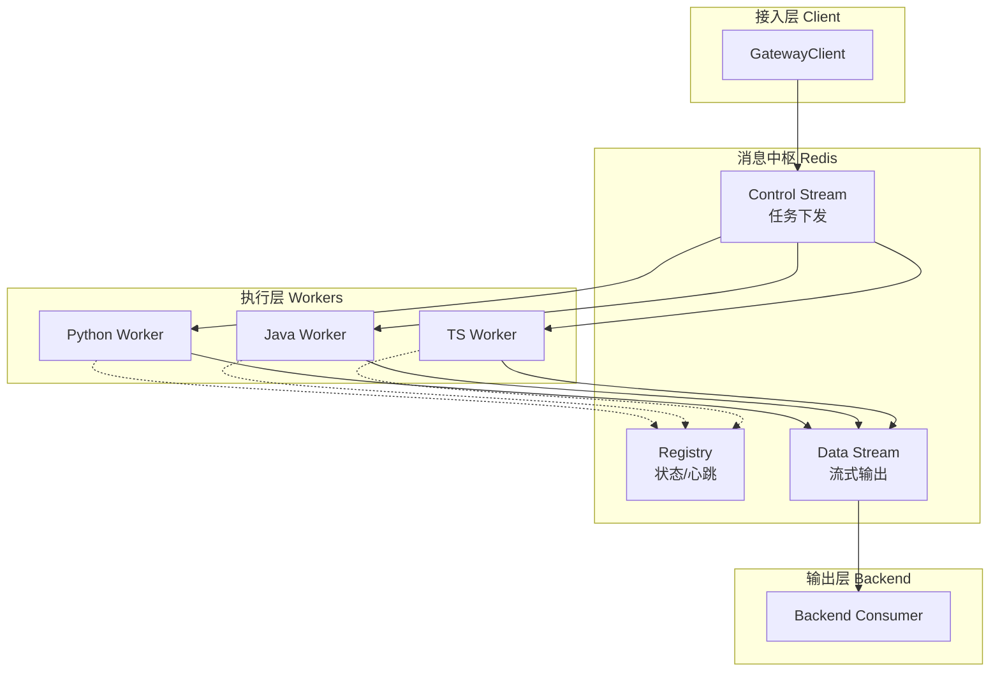

---
hide:
  - navigation
  - toc
  - header
  - tabs
---

  <h1>by-framework</h1>
  

    企业级 AI Agent 分布式调度中枢 
    基于 Redis Streams 构建，支持 Python、Java、TypeScript 的高度解耦架构。
  

  

    <a href="guide/getting-started/" class="md-button md-button--primary">快速开始</a>
    <a href="architecture/overview/" class="md-button">架构解析</a>
  

-   :material-clock-fast: **分布式任务调度**

    ---
    采用 **事件驱动** 架构。通过 `GatewayClient` 和 `GatewayWorker` 以及 Redis Streams 消费组，实现生产者与消费者完全解耦，支持平滑扩容与负载均衡。

-   :material-translate: **多语言一致性**

    ---
    为 Python、Java、TS 提供一致的编程模型。基于标准化的 `AskAgentCommand` 和 `AgentTaskResult` 契约，跨语言无缝对接同一消息中枢。

-   :material-shield-check-outline: **全生命周期管控**

    ---
    基于 **AgentContext** 上下文机制。提供非阻塞流式发射，框架底层接管线程取消指令（避免死锁），并自动规范化业务返回结果。

-   :material-puzzle-outline: **高度插件化扩展**

    ---
    基于 **Interceptor/Plugin** 洋葱圈模型设计。支持在各种生命周期切面（如 pre_process, post_process）进行无侵入式拦截、审计与工具注入。

-   :material-network-outline: **智能服务发现**

    ---
    内置 Registry 机制，Worker 节点支持自动化注册与心跳健康检测。结合 Discovery Client，可实现动态标签路由与请求的高可用容灾。

-   :material-monitor-eye: **全链路可观测**

    ---
    从客户端下发指令到服务端执行生成，原生提供端到端的 Tracing 追踪支持。精准捕获执行耗时、状态流转与异常堆栈。

---

## 🏗️ 系统架构

框架采用 **控制流 (Control Plane)** 与 **数据流 (Data Plane)** 分离的设计理念：

---

## 🛠️ 快速导航

-   :rocket: **[快速开始](guide/getting-started.md)**
    从零搭建第一个分布式 Agent。

-   :material-sitemap: **[架构深度剖析](architecture/overview.md)**
    了解 Redis Streams 背后的路由与竞争消费机制。

-   :material-code-json: **[Worker 开发指南](guide/worker-guide.md)**
    掌握 GatewayWorker 的核心实现技巧。

-   :material-api: **[API 参考](reference/index.md)**
    查看 Python / Java / TS 的完整 API 列表。

-   :material-send-check-outline: **[Client 接入指南](guide/client-guide.md)**
    学习如何使用 GatewayClient 优雅地下发任务与接收流式结果。

-   :material-toy-brick-outline: **[插件开发指南](guide/plugin-guide.md)**
    了解如何编写自定义 Plugin 和 Interceptor 来拓展框架功能。

