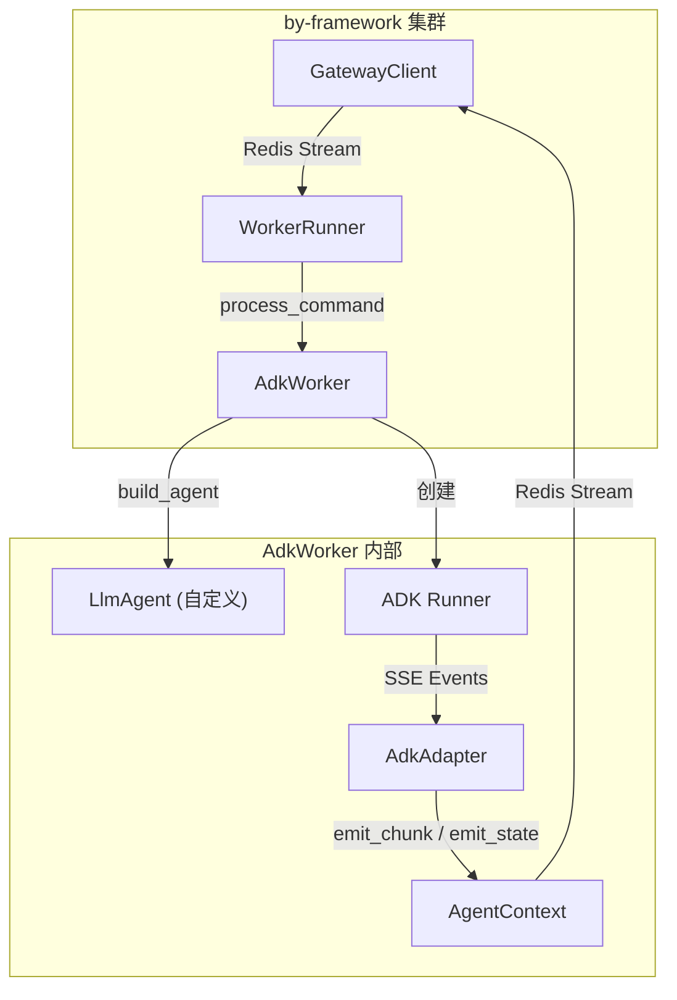

# Google ADK 集成

`by-framework-adk` 是将 Google Agent Development Kit (ADK) Agent 接入 by-framework 的桥接库。它通过 `AdkAdapter` 将 ADK Runner 的 SSE 事件流无缝转换为 by-framework 的标准协议事件，让你用最少的代码将 ADK Agent 部署到 by-framework 分布式集群中。

## 安装

```bash
pip install by-framework-adk
```

依赖：

- `by-framework >= 0.2.0`
- `google-adk` — Google Agent Development Kit
- `google-genai` — Google Generative AI SDK

## 架构概览



## 核心组件

| 组件 | 位置 | 说明 |
|------|------|------|
| `AdkWorker` | `by_framework_adk.worker` | 继承自 `ByaiWorker`，管理 ADK Session 与 Runner 生命周期 |
| `AdkAdapter` | `by_framework_adk.adapter` | 消费 ADK Runner 的 SSE 事件，转换为 by-framework 协议事件 |
| `_utils` | `by_framework_adk._utils` | 内容提取与恢复数据处理工具 |

## 快速开始

### 1. 创建 Worker

```python
import os
from by_framework_adk import AdkWorker
from by_framework import GatewayCommand, AgentContext, run_worker
from google.adk.agents.llm_agent import LlmAgent
from google.adk.models.lite_llm import LiteLlm


class MyAdkAgent(AdkWorker):
    """自定义 ADK Agent"""

    def get_agent_types(self) -> list[str]:
        # 声明此 Worker 处理的 Agent 类型
        return ["my-adk-agent"]

    def build_agent(self, context: AgentContext, command: GatewayCommand) -> LlmAgent:
        """构建 ADK LlmAgent 实例。

        每次任务执行时由框架调用，可根据 command 内容动态构建不同的 Agent。
        """
        return LlmAgent(
            name="my_assistant",
            model=LiteLlm(
                model=os.getenv("LLM_MODEL", "gpt-4o"),
                temperature=0.2,
                api_key=os.getenv("OPENAI_API_KEY"),
                api_base=os.getenv("OPENAI_BASE_URL"),
            ),
            instruction=(
                "You are a helpful assistant. "
                "Always be concise and accurate in your responses."
            ),
            tools=[get_current_time, get_weather],
        )


# 工具函数 —— 直接注册为 ADK Tool
def get_current_time() -> str:
    """获取当前时间"""
    from datetime import datetime
    return datetime.now().strftime("%Y-%m-%d %H:%M:%S")


def get_weather(city: str) -> dict:
    """获取指定城市的天气信息"""
    # 实际项目中接入真实天气 API
    return {
        "city": city,
        "temperature": 25,
        "condition": "晴",
        "humidity": 60,
    }


if __name__ == "__main__":
    run_worker(
        MyAdkAgent,
        worker_id=os.getenv("BYAI_WORKER_ID", "adk-worker"),
        redis_host=os.getenv("BYAI_REDIS_HOST", "127.0.0.1"),
        redis_port=int(os.getenv("BYAI_REDIS_PORT", "6379")),
    )
```

### 2. 发送任务

```python
from by_framework import ByaiGatewayClient, init_redis, WorkerRegistry

async def send_task():
    redis = init_redis(host="localhost", port=6379)
    registry = WorkerRegistry(redis_client=redis)
    client = ByaiGatewayClient(registry=registry, redis_client=redis)

    response = await client.send_message(
        target_agent_type="my-adk-agent",
        session_id="session-001",
        content="北京今天天气怎么样？",
    )
    print(f"任务已发送: {response.message_id}")

```

## AdkWorker 详解

### 类层次

```
GatewayWorker              (by_framework)
  └── ByaiWorker            (by_framework)
       └── AdkWorker        (by_framework_adk)
```

`AdkWorker` 继承 `ByaiWorker`，这意味着它自动获得了 Byai 消息格式的解码能力（`BaiYingMessage` → `ByaiAskAgentCommand`）。

### 需要实现的方法

| 方法 | 说明 |
|------|------|
| `get_agent_types()` | 返回此 Worker 能处理的 Agent 类型列表 |
| `build_agent(context, command)` | **核心方法**。根据上下文和命令动态构建并返回 `LlmAgent` 实例 |

### 可选覆盖的方法

| 方法 | 默认行为 | 说明 |
|------|---------|------|
| `get_model()` | 使用 `build_agent` 返回的 Agent 的 model | 自定义模型配置 |
| `get_session_service()` | `InMemorySessionService` | 自定义 Session 存储（可替换为 Redis/Postgres 后端） |

### process_command 流程

`AdkWorker.process_command` 的内部流程：

1. 调用 `self.build_agent(context, command)` 获取 `LlmAgent` 实例
2. 创建 ADK `Runner`（绑定 Agent 和 SessionService）
3. 创建 `AdkAdapter` 并调用 `adapter.run(command)`
4. Adapter 调用 `runner.run_async()` 以 SSE 流模式执行
5. 逐个处理 ADK 事件 part，转换为 by-framework 协议事件

## AdkAdapter 事件映射

`AdkAdapter` 负责将 Google ADK 的事件类型映射为 by-framework 标准事件：

| ADK Event Part | by-framework 事件 | 说明 |
|---------------|-------------------|------|
| `text` (普通文本) | `emit_chunk(content, content_type=SseMessageType.text)` | 流式文本输出 |
| `text` (最终回答) | `emit_chunk(content, event_type=EventType.FINAL_ANSWER)` | 标记为最终回答 |
| `function_call` | `emit_chunk(StreamChunkEvent(tool_calls=[...]))` | 工具调用 |
| `function_response` | `emit_chunk(StreamChunkEvent(tool_responses=[...]))` | 工具返回 |
| `executable_code` | `emit_chunk(content, content_type=SseMessageType.text)` | 代码执行输出 |

### 类型感知的内容输出

Adapter 根据内容类型自动选择合适的 `content_type`：

- **普通文本** → `SseMessageType.text` (1002)
- **代码/代码执行** → `SseMessageType.text` (1002)，内容包裹在代码块格式中

## 模型配置

`AdkWorker` 通过 Google ADK 的 `LiteLlm` 支持多种 LLM 提供商：

```python
from google.adk.models.lite_llm import LiteLlm

# OpenAI 兼容 API
model = LiteLlm(
    model="gpt-4o",
    temperature=0.2,
    api_key=os.getenv("OPENAI_API_KEY"),
    api_base=os.getenv("OPENAI_BASE_URL"),
)

# 或使用 Gemini
from google.adk.models.gemini import Gemini
model = Gemini(model="gemini-2.0-flash", temperature=0.2)
```

## Session 管理

默认使用 `InMemorySessionService`，适合开发和小规模部署。对于生产环境，建议实现自定义的持久化 Session Service：

```python
from google.adk.sessions import BaseSessionService

class MySessionService(BaseSessionService):
    # 实现 Redis / Postgres 持久化的 Session 管理
    ...
```

## 与标准 GatewayWorker 的对比

| 特性 | 标准 GatewayWorker | AdkWorker |
|------|-------------------|-----------|
| 编程模型 | 手动调用 emit/askUser/callAgent | ADK Agent + Tool 声明式 |
| 工具定义 | 通过 Plugin 注册 | 直接作为 ADK Tool 函数 |
| 流式输出 | 手动 `emit_chunk` | ADK Runner 自动生成，Adapter 转发 |
| 状态管理 | 手动管理 AgentRuntimeState | ADK Session 自动管理 |
| 适用场景 | 完全自定义的 Agent 逻辑 | 基于 LLM 的对话式 Agent |
| 多轮对话 | 手动处理 ResumeCommand | ADK Session 自动处理上下文 |

## 完整的环境变量配置

```bash
# .env 文件示例
BYAI_WORKER_ID=adk-worker
BYAI_REDIS_HOST=127.0.0.1
BYAI_REDIS_PORT=6379
BYAI_REDIS_USERNAME=
BYAI_REDIS_PASSWORD=

# LLM 配置
LLM_MODEL=gpt-4o
OPENAI_API_KEY=sk-xxx
OPENAI_BASE_URL=https://api.openai.com/v1
```
